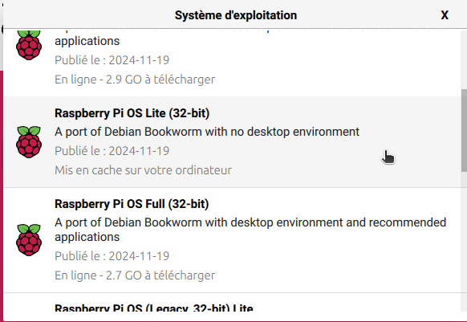

# poulatof

This project is an automatic door open/close for chicken. It is based on Raspberry Pi Zero WH, Raspberry Pi OS Bookworm and Python. The door will be open at sunrise, and close at sunset. By default, HDMI and sound are deactivated for low consumption. This system use UTC time, so no need to use any timezone.

a little movie of the behavior : https://github.com/ctotof38/poulatof/blob/main/pictures/porte_poule.mp4

functionalities :
- if the motor button is set, long press stops engine, short press reverses engine
- if the sensor up and down are set, the motor is automatically stopped when they are reached. In any case, the motor is stopped after a period of time
- a http server is started to answer to some API requests :
  * POST http://<ip_of_your_raspberry>:<port>
  *     headers {Authorization: <token>}
  *     data   {'action': <action>}
  *     action accept values: up, down, force_up, force_down
  *  port and token are set in chicken.json

force_up and force_down send motor command without checking door sensors. It can be used when a problem occurs on sensor.

When the program start, it check door state according to hour. And open or close door in this case. Usable when reboot.
This new release look for a Wifi network, to get time from NTP server
A watchdog sends regularly a systemd message. If not, systemd restart the process
A configuration describe which GPIO to use, you can update it like you want. BUT, select GPIO with pull down at startup to command the motor, otherwise your motor is turn on during boot process. See https://elinux.org/RPi_BCM2835_GPIOs to use the good GPIO. The default used is correct.

All actions describe here were done on a Linux computer, so adjust some of them for a Windows environment.

You can test it on a standard Linux computer, there is a tkinter simulator to check functionalities

## 1. Pre-requisite

If you just want to test it, there is only one need : python3

Otherwise, you'll need a Raspberry Pi and some electronics components.

## 2. Computer Linux Environment to check program

### 2.1. Python

You will use a virtual environment to not overload your system. So, you need to launch some commands before starting

```linux environment
sudo apt install python3-pip python3-venv
python3 -m venv venv
source venv/bin/activate
pip install --upgrade pip
pip install wheel
pip install pyephem
```

launch the command :

```start script
./door_management.sh
```

It use default chicken.json configuration file. See chapter 3.8 for explanation.


## 3. Raspberry Environment

### 3.1. Linux installation

Insert SD card into your computer.

use rpi-imager to flash the SD card


select choice: Raspberry Pi OS (other)


select Bookworm Lite 32 bit



in general config, set hostname, user, wifi configuration, country, timezone


activate ssh, with public key


and click on Yes (OUI) to flash SD card and confirm


first boot is long on Pi Zero, wait at least 5 minutes


### 3.2. Linux configuration

start your Raspberry Pi. Normally, it will connect to your Wifi network. You can now connect to it with the default you set, here antoinette. Example with address 192.168.20.100

```connect to
ssh antoinette@192.168.20.100
```

use raspi-config if you want to set another Wifi network

```config raspberry
sudo raspi-config
```

To preserve your SD card, you set somes directories in tmpfs (it use memory). It is important to set /tmp in tmpfs because all temporary files doesn't use SD card !

you add these lines into /etc/fstab
```fstab
tmpfs   /tmp            tmpfs   defaults 0      0
tmpfs   /var/log        tmpfs   defaults 0      0
```

Then remove temporary file and reboot

```
cd /var/log
sudo rm -rf * && sudo reboot
```

### 3.3. ssh security

You will now generate certificates, to allow only some computer to connect to it.
The next command generates in $HOME/.ssh directory the files : id_rsa (private key), id_rsa.pub (public key). Keep default option.

```ssh key
ssh-keygen -b 4096
```
You'll see in the next chapter how to improve security with certificates

change default port for SSH. Edit file /etc/ssh/sshd_config and uncomment line port to set your port. Example :

```ssh port
Port 10022
```

### 3.4. Linux optimization

In this chapter, you'll disable some services to consume less and less energy

disable sound equipment

```disable equipment
echo "blacklist snd_bcm2835" |sudo tee /etc/modprobe.d/blacklist-sound.conf
```

disable HDMI

```
echo '[Unit]
Description=Disable HDMI

[Service]
Type=oneshot
ExecStart=/usr/bin/vcgencmd display_power 0

[Install]
WantedBy=multi-user.target' |sudo tee /etc/systemd/system/disable-hdmi.service

sudo systemctl enable disable-hdmi.service
```

disable Bluetooth
```
sudo systemctl stop bluetooth.service
sudo systemctl disable bluetooth.service
sudo systemctl stop hciuart.service
sudo systemctl disable hciuart.service
```


### 3.6. Software installation

In the current directory, you'll find a script named : save.sh

launch it, it generate a file : ../door_management.tgz

You just have to send it to your Raspberry, and extract it where you want, for example:

send it to /tmp with previous configuration to the Raspberry

```package transfer
scp -P 10022 ../door_management.tgz antoinette@my_chicken_raspberry:/tmp
```

and in Raspberry, extract it in HOME directory :

```package install
cd
tar xf /tmp/door_management.tgz
```

### 3.7. Python

You will use a virtual environment to not overload your system. So, you need to launch some commands before starting

```python config
sudo apt install python3-pip python3-venv python3-gpiozero
python3 -m venv venv
source venv/bin/activate
pip install --upgrade pip
pip install wheel
pip install gpiozero
pip install RPi.GPIO
pip install pyephem
```

### 3.8. program configuration

This program uses default configuration file chicken.json. You can change it with option -c.
The current configuration is according to this picture : https://github.com/ctotof38/poulatof/blob/main/pictures/pi_zero_connection.png

the configuration file looks like:

```package configuration
{
  "motor_button_gpio": 24,
  "motor_forward_gpio": 9,
  "motor_backward_gpio": 25,
  "door_closed_gpio": 7,
  "door_opened_gpio": 5,
  "open_timeout": 12,
  "close_timeout": 10,
  "longitude": "2.294270",
  "latitude": "48.858823",
  "log_level": "debug",
  "log_file": "/tmp/automatic_door.log",
  "security_time": 2200,
  "user_mail": "poulatof@gmail.com",
  "destination_mail": "red.fox@gmail.com",
  "password_mail": "machine_password",
  "watch_dog": 300
}
```

mandatory parameters are :
- <b>motor_forward_gpio</b>
- <b>motor_backward_gpio</b>

The minimum action is to commmand the motor :)

if <b>door_closed_gpio</b> and/or <b>door_open_gpio</b> exist, it corresponds to sensor which detect door at the top or bottom. In this case, the motor is stopped. Otherwise, a timeout is used <b>open_timeout</b> and <b>close_timeout</b>. Default value is 20 seconds. According to your installation, you'll be able to swap GPIO value closed and opened. Select GPIO with pull up at startup. I use two separate timeout because I can see that open door is longer than close door.

if <b>motor_button_gpio</b> exists, you can start/stop the door manually

if <b>security_time</b> exists, it add these seconds to the sun set time. To be sur our chicken are in home. Default value is 1800 seconds

<b>longitude</b> and <b>latitude</b> are used to calculate sun set and sun rise. If absent, use default Eiffel tower position.

if <b>log_level</b> exists, it configure the log level : debug, info, warning, error. Default is warning.

if <b>log_file</b> exists, it generates 5 rolling files of 100ko.

if <b>user_mail</b> and <b>destination_mail</b> exist, the software is ready to send email.
- set it into <b>password_mail</b> key in the configuration file

So, when email is activated, each time you activate Wifi, you receive a report. And the log rotates, so you don't receive it twice. Here is a text example:
```report
+---------------------+-------+
| 2020-10-23 19:23:32 | close |
| 2020-10-24 08:04:59 | open  |
| 2020-10-24 19:21:56 | close |
| 2020-10-25 07:06:20 | open  |
| 2020-10-25 18:20:22 | close |
| 2020-10-26 07:07:41 | open  |
+---------------------+-------+
```
This case shows the time change the 2020-10-25 :)

### 3.9. email configuration

To use the email mechanism, you have to create a google account with an application password:
https://support.google.com/accounts/answer/185833?hl=en

```email configuration
create google account
activate 2 step verification
   go to manage you google account
   Security
   Signing in to Google
   2-Step verification
      Add your phone number

Once done, return to this menu, you have a new option
   go to manage you google account
   Security
   Signing in to Google
   Add passwords
      You have to set a machine type, a name, and it generate a long password
```

You can now use it in your python mail script to connect to the gmail account to send email

### 3.10. automatic start

Create service and enable it

```
echo '
[Unit]
Description=Door Daemon Application
After=network.target
OnFailure=reboot.target

[Service]
StandardOutput=append:/tmp/door_systemd.log
StandardError=append:/tmp/door_systemd.log
Type=simple
User=antoinette
WorkingDirectory=/home/antoinette
Environment=PYTHONUNBUFFERED=1
ExecStart=/home/antoinette/door_management.sh
Restart=always
RestartSec=5
WatchdogSec=660
NotifyAccess=all
StartLimitBurst=3
StartLimitInterval=1200
StartLimitAction=reboot

[Install]
WantedBy=multi-user.target' |sudo tee /etc/systemd/system/door-daemon.service


sudo systemctl enable door-daemon.service
```

The script called by this service (door_management.sh) wait until 30 seconds that wlan0 is UP. The, it switch OFF the led, send email to
notify that service will start soon, and launch the door management

### 3.11. watchdog

The program sends every 5 minutes a notification to the systemd service, which has a watch dog set to 6 minutes. If no signal is received, systemd restart the system

It also check the RPI temperature, and send email once when temperature is higher than 50°c, 70°c and 80°c

## 4. The ultimate configuration

When all is ready, you just have to configure the Wifi network of your Raspberry with the shared Wifi of your smartphone. Then, system is working on its own. And when you want to have a resume, you just have to activate your shared Wifi, press Wifi button of this system, and you'll receive the last actions.


